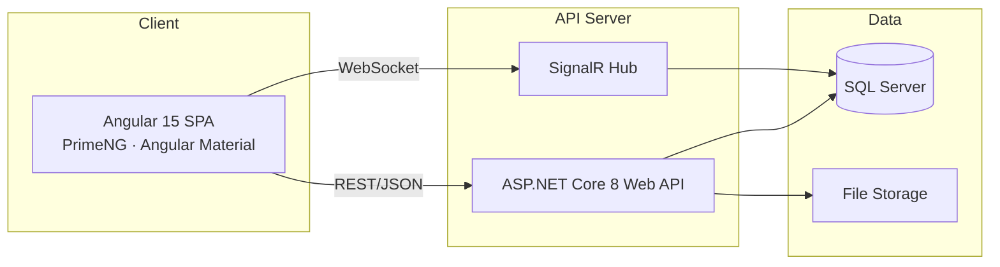
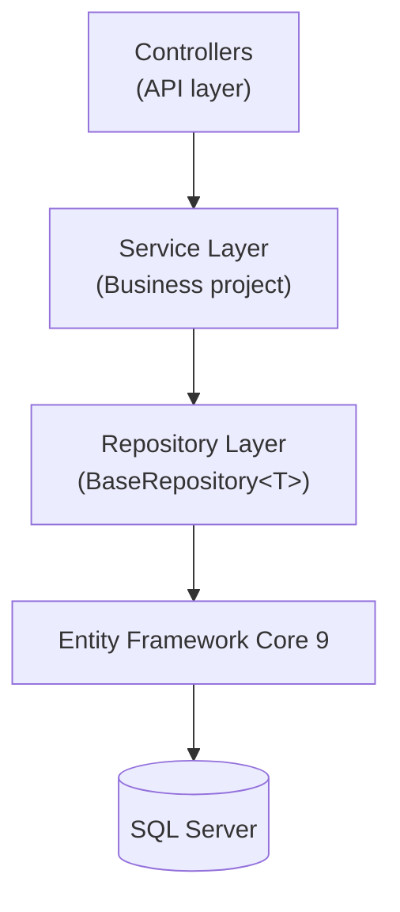
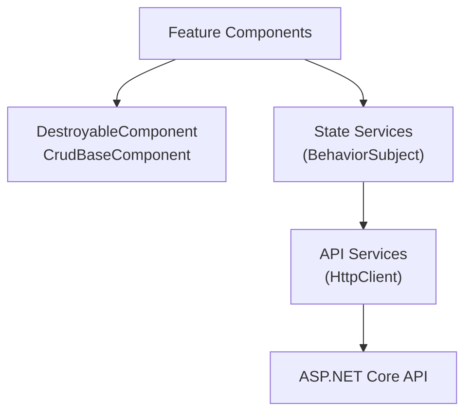
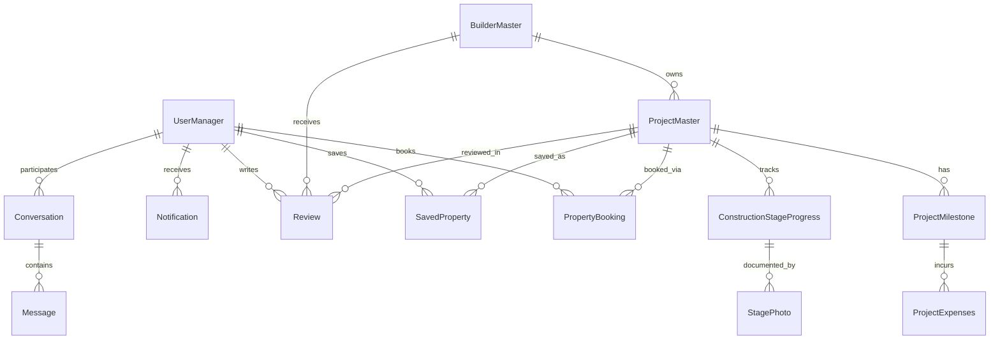
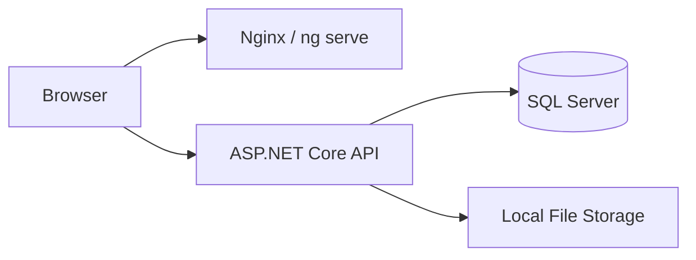
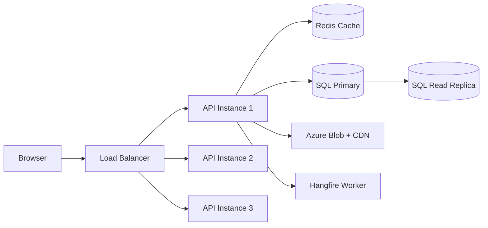
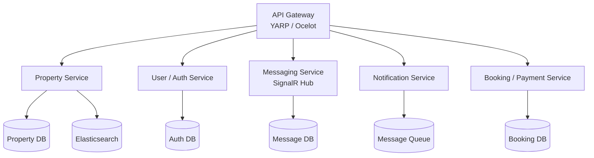
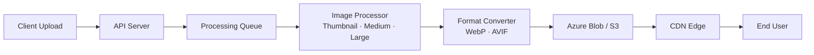
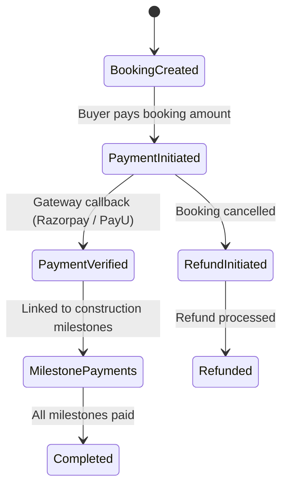
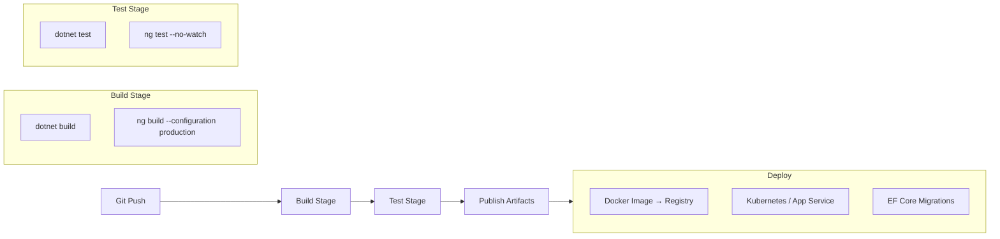

# BrickNTrack - Architecture Document

> **Last updated:** 2026-03-22
>
> A real estate platform connecting home seekers with verified builders, featuring property search, construction progress tracking, and real-time messaging.

---

## Table of Contents

1. [System Overview](#1-system-overview)
2. [Current Architecture](#2-current-architecture)
3. [Data Model](#3-data-model)
4. [API Endpoints Summary](#4-api-endpoints-summary)
5. [Search Architecture](#5-search-architecture)
6. [Location & Maps Architecture](#6-location--maps-architecture)
7. [Scalability Roadmap](#7-scalability-roadmap)
8. [Image / Media Architecture](#8-image--media-architecture)
9. [Payment Integration (Future)](#9-payment-integration-future)
10. [Security Considerations](#10-security-considerations)
11. [Monitoring & Observability (Future)](#11-monitoring--observability-future)
12. [CI/CD Pipeline (Future)](#12-cicd-pipeline-future)

---

## 1. System Overview

BrickNTrack is a three-tier web application that connects home seekers (**Buyers**) with construction companies (**Builders**), supervised by platform administrators (**Admins**).

### High-Level Architecture



### Technology Stack

| Layer       | Technology                                    |
|-------------|-----------------------------------------------|
| Frontend    | Angular 15, PrimeNG, Angular Material         |
| API         | ASP.NET Core 8, Entity Framework Core 9       |
| Real-time   | SignalR (WebSocket with fallback)              |
| Database    | SQL Server                                    |
| Auth        | JWT (access + refresh tokens), role-based      |

### User Roles

| Role    | Description                                           |
|---------|-------------------------------------------------------|
| Admin   | Platform management, builder verification, reports    |
| Builder | Construction companies that list and manage projects  |
| Buyer   | Home seekers who search, save, book, and review       |

---

## 2. Current Architecture

### Backend Layers



**Repository pattern** -- All data access goes through `BaseRepository<T>`, which provides standard CRUD operations. Entity-specific repositories extend it when custom queries are needed.

**Service layer** -- The `Business` project houses domain logic. Services like `BudgetCalculationService` coordinate across multiple entity boundaries (milestones and expenses) to compute budget summaries.

**Global soft-delete** -- Every entity inherits from `CommonEntity`, which includes an `IsActive` flag. EF Core's `HasQueryFilter` is configured globally so that soft-deleted records are excluded from all queries by default, without requiring per-query filtering.

### Frontend Patterns



**Base component classes:**

- `DestroyableComponent` -- manages RxJS subscription cleanup via a `destroy$` subject, preventing memory leaks on component destruction.
- `CrudBaseComponent` -- extends `DestroyableComponent` with reusable list/create/update/delete workflows, pagination, and dialog management.

**State management** -- Lightweight, service-based state using RxJS `BehaviorSubject`. Key state services include:

- `NotificationState` -- unread count, notification list, real-time badge updates.
- `MessagingState` -- active conversations, message history, typing indicators.

No external state library (NgRx, Akita) is used; the BehaviorSubject approach keeps complexity low for the current feature set.

---

## 3. Data Model

### Entity Relationship Diagram



### Key Entities

| Entity                     | Purpose                                                       |
|----------------------------|---------------------------------------------------------------|
| `UserManager`              | All users (Admin, Builder, Buyer) with role and credentials   |
| `BuilderMaster`            | Construction company profile; `IsVerified` badge set by Admin |
| `ProjectMaster`            | Property listing with 30+ metadata fields (BHK, price, area, amenities, coordinates, etc.) |
| `ProjectMilestone`         | Construction phase (e.g., Foundation, Structure, Finishing)    |
| `ProjectExpenses`          | Line-item costs within a milestone                            |
| `ConstructionStageProgress`| Timestamped build progress updates                            |
| `StagePhoto`               | Photographic evidence attached to progress updates            |
| `Conversation`             | Chat thread between two users                                 |
| `Message`                  | Individual message within a conversation (SignalR-delivered)   |
| `Notification`             | In-app notification (booking updates, reviews, milestones)    |
| `PropertyBooking`          | Booking request from Buyer for a property                     |
| `Review`                   | Rating and text review on a project or builder                |
| `SavedProperty`            | Buyer's wishlist / shortlisted properties                     |

All entities inherit `CommonEntity` fields: `Id`, `IsActive`, `CreatedBy`, `CreatedDate`, `ModifiedBy`, `ModifiedDate`.

---

## 4. API Endpoints Summary

### Public Endpoints (No Auth Required)

| Area            | Endpoint Pattern              | Description                                |
|-----------------|-------------------------------|--------------------------------------------|
| Property Search | `GET /api/PropertySearch`     | Search with filters (city, price, BHK, etc.) |
| Property Search | `GET /api/PropertySearch/suggest` | Autocomplete returning properties, builders, locations |
| Property Search | `GET /api/PropertySearch/{id}`| Property detail                            |
| Builder         | `GET /api/Builder/getAllActive`| List verified builders                    |
| Builder         | `GET /api/Builder/{id}`       | Builder profile and projects              |

### Authenticated Endpoints

| Area          | Operations                        | Roles           |
|---------------|-----------------------------------|-----------------|
| Project       | CRUD (create, read, update, delete) | Builder        |
| Milestone     | CRUD within a project             | Builder         |
| Expense       | CRUD within a milestone           | Builder         |
| Booking       | Create, view, update status       | Buyer, Builder  |
| Review        | Create, list by project/builder   | Buyer           |
| Messaging     | Send, list conversations, history | All             |
| Notifications | List, mark read, preferences      | All             |
| Saved Property| Add, remove, list                 | Buyer           |

### Admin-Only Endpoints

| Area                | Operations                                      |
|---------------------|-------------------------------------------------|
| User Management     | List, activate/deactivate, role assignment       |
| Builder Verification| Review and approve/reject builder applications   |
| Reports             | Platform analytics, booking summaries, revenue   |

---

## 5. Search Architecture

### v1 -- Current Implementation

```
User types query
    → 300ms debounce (client-side)
    → GET /api/PropertySearch/suggest?q=...
    → EF Core LINQ: SQL LIKE / CONTAINS on ProjectName, City, Locality, BuilderName
    → Returns grouped results: properties, builders, locations
```

- Filtering by price range, BHK count, property type, city, locality.
- Geo bounding-box filter using `Latitude`/`Longitude` columns for map-viewport queries.
- Adequate for small-to-medium datasets (under 10K properties).

### v2 -- Full-Text Search (Planned)

| Aspect        | Detail                                                       |
|---------------|--------------------------------------------------------------|
| Engine        | SQL Server Full-Text Index                                   |
| Indexed columns | `ProjectName`, `ProjectAddress`, `City`, `Locality`, `BuilderMaster.Name` |
| Query mode    | `FREETEXT` for natural queries, `CONTAINS` for precise matches |
| Ranking       | Weighted: project name (highest) > address > city (lowest)   |
| Benefit       | Typo tolerance, stemming, word-breaking without app changes  |

### v3 -- Dedicated Search Engine (Future)

| Aspect           | Detail                                                    |
|------------------|-----------------------------------------------------------|
| Engine           | Elasticsearch or Azure Cognitive Search                   |
| Index sync       | Real-time via change tracking or transactional outbox pattern |
| Faceted search   | Price ranges, BHK counts, property types exposed as facets |
| Synonyms         | `flat` = `apartment`, `house` = `villa`                   |
| NLP queries      | `"3BHK near metro under 80L in Gachibowli"`              |

---

## 6. Location & Maps Architecture

### Current

- Each property stores `Latitude` and `Longitude`.
- `Locality` field enables neighborhood-level filtering.
- Geo bounding-box queries filter properties visible in the map viewport.

### Future

**Locations master table:**

| Column     | Type     | Description                              |
|------------|----------|------------------------------------------|
| `Id`       | int (PK) | Primary key                              |
| `Name`     | string   | Location name                            |
| `Type`     | enum     | City, Zone, or Locality                  |
| `ParentId` | int (FK) | Self-referencing hierarchy               |
| `Lat`      | decimal  | Center latitude                          |
| `Lng`      | decimal  | Center longitude                         |
| `Boundary` | geometry | Polygon boundary for area searches       |

Pre-populated with Indian locality data for structured location search.

**Map features roadmap:**

- Reverse geocoding on property create (auto-fill locality from lat/lng).
- Leaflet + OpenStreetMap integration for interactive map views.
- Split-pane search UI: property list (left 40%) + interactive map (right 60%).
- Cluster markers when zoomed out; individual pins when zoomed in.
- "Draw to search" -- user draws a polygon on the map to define a search area.
- Nearby amenities overlay (schools, hospitals, metro stations).
- Commute time calculator via OSRM or Google Directions API.

---

## 7. Scalability Roadmap

### Phase 1: Current (Single Server)



- Single SQL Server instance, single API process.
- Angular served via development server or Nginx.
- Suitable for: up to **10K properties**, **1K concurrent users**.

### Phase 2: Medium Scale (10K--100K Properties)



| Component        | Purpose                                                  |
|------------------|----------------------------------------------------------|
| Read replicas    | Offload reporting and search queries from primary DB     |
| Redis            | Cache search results (5 min TTL), builder profiles, sessions |
| CDN              | Serve property images via Azure Blob Storage + CDN edge  |
| Load balancer    | Distribute traffic across 2--3 API instances             |
| Hangfire         | Background jobs: email, report generation, image resize  |
| Covering indexes | On search-heavy columns (City, Locality, Price, BHK)    |

### Phase 3: Large Scale (100K+ Properties, 10K+ Concurrent)



| Component              | Purpose                                              |
|------------------------|------------------------------------------------------|
| Elasticsearch          | Replace SQL LIKE queries with full-text search       |
| Event-driven sync      | Property changes propagate to search index via queue |
| Microservice split     | Independent deploy and scaling per domain            |
| Database per service   | Bounded contexts, no cross-service DB joins          |
| API Gateway            | Routing, rate limiting, auth forwarding              |
| Kubernetes / ACA       | Container orchestration and auto-scaling             |

### Phase 4: Enterprise Scale

| Capability           | Approach                                                |
|----------------------|---------------------------------------------------------|
| CQRS                 | Separate read/write models for property data           |
| Event Sourcing       | Full audit trail for property changes and booking flow |
| GraphQL gateway      | Tailored data fetching for mobile apps                 |
| Multi-region deploy  | Low-latency access across geographies                  |
| ML pipeline          | Property recommendations, price predictions, fraud detection |

---

## 8. Image / Media Architecture

### Current

- Files stored on local disk (`/tmp/BrickNTrack/`).
- Served via ASP.NET Core static file middleware.

### Future



| Feature              | Detail                                                |
|----------------------|-------------------------------------------------------|
| Cloud storage        | Azure Blob Storage or AWS S3                         |
| Resize pipeline      | Generate thumbnail, medium, and large variants       |
| Format conversion    | WebP / AVIF for reduced payload sizes                |
| Virtual tours        | 360-degree photos and video tour hosting             |
| Floor plans          | SVG rendering for interactive floor plan views       |

---

## 9. Payment Integration (Future)

### Flow



| Aspect                | Detail                                               |
|-----------------------|------------------------------------------------------|
| Gateway               | Razorpay or PayU                                    |
| Milestone payments    | Pay X% at foundation, Y% at structure, etc.         |
| Status tracking       | Pending, Verified, Completed                         |
| Refunds               | Handled for cancelled bookings                       |
| Invoicing             | GST-compliant invoice generation                     |

---

## 10. Security Considerations

| Area                   | Implementation                                         |
|------------------------|--------------------------------------------------------|
| Authentication         | JWT with 24h expiry + refresh token rotation           |
| Authorization          | Role-based (`[Authorize(Roles = "Admin")]`) on all protected endpoints |
| Data deletion          | Global soft-delete via `IsActive` flag -- no hard deletes |
| CORS                   | Restricted to known frontend origins                   |
| Rate limiting          | Applied on public endpoints (search, suggest)          |
| Input validation       | Model validation attributes (`[Required]`, `[Range]`, etc.) |
| SQL injection          | Prevented by EF Core parameterized queries             |
| XSS                    | Angular's built-in output sanitization                 |

---

## 11. Monitoring & Observability (Future)

| Component            | Tool / Approach                                       |
|----------------------|-------------------------------------------------------|
| Structured logging   | Serilog with sinks to Seq or ELK stack               |
| APM                  | Application Insights for request tracing and latency |
| Health checks        | `/health` endpoint for liveness and readiness probes |
| Dashboards           | Grafana -- API latency, search performance, user activity |
| Alerting             | Error rate spikes, slow queries (>2s), failed login bursts |

---

## 12. CI/CD Pipeline (Future)



| Stage         | Detail                                                    |
|---------------|-----------------------------------------------------------|
| Platform      | GitHub Actions or Azure DevOps                            |
| Build         | `dotnet build` + `ng build --configuration production`    |
| Test          | `dotnet test` + `ng test --no-watch`                      |
| Containerize  | Docker images pushed to container registry                |
| Deploy        | Rolling deployment to Kubernetes or Azure App Service     |
| Migrations    | EF Core migrations applied automatically during deploy    |
| Feature flags | Gradual rollout of new features to subsets of users       |

---

*This document is a living reference. Update it as architectural decisions are made and the system evolves.*

---

## Appendix: Implementation Status (as of 2026-03-22)

### Completed Features

| Feature | Status | Notes |
|---------|--------|-------|
| **Global EF Soft-Delete Filter** | Done | `HasQueryFilter` on all `CommonEntity` types. `IgnoreQueryFilters()` for "Get All" endpoints |
| **Generic BaseRepository<T>** | Done | `Query()`, `QueryAll()`, `GetByIdAsync()`, `AddAsync()`, `Update()`, `SoftDeleteAsync()` |
| **BudgetCalculationService** | Done | Extracted from ExpensesRepositories, injected into ExpenseService |
| **DB-Level Pagination** | Done | `IQueryable` chain in ProjectService.GetProjectsPaginatedAsync |
| **Frontend DestroyableComponent** | Done | All 9 components extended, `takeUntil(this.destroy$)` on all subscriptions |
| **Frontend CrudBaseComponent<T>** | Done | Builder, Project, Milestone, Expenses components refactored |
| **BehaviorSubject State Management** | Done | NotificationState, MessagingState with real-time updates in header |
| **Self-Registration** | Done | Public `/Register` endpoint (Buyer/Builder only, Admin blocked) |
| **Builder Verification Badge** | Done | `IsVerified` on BuilderMaster, admin-only verify endpoint, blue tick in UI |
| **Admin User Seeder** | Done | Auto-creates admin on startup via `DbSeeder` |
| **Property Search (30+ fields)** | Done | CarpetArea, FurnishingStatus, FacingDirection, Floor, Parking, etc. |
| **Search Autocomplete** | Done | `/suggest` endpoint returning properties, builders, locations |
| **Geo Bounding Box Filter** | Done | `minLat/maxLat/minLng/maxLng` on search endpoint |
| **Sort Options** | Done | price_asc, price_desc, newest, completion, area |
| **7 Advanced Filters** | Done | Furnishing, facing, transaction, area range, gated community, parking |
| **EMI Calculator** | Done | Frontend-only, on property detail page |
| **Property Comparison** | Done | Up to 4 properties side-by-side, 23 comparison fields |
| **Share Property** | Done | Web Share API + clipboard fallback, public URL |
| **Save/Shortlist** | Done | Save, unsave, list saved, check saved. Saved Properties page |
| **Recently Viewed** | Done | localStorage-based, max 10 items |
| **View Count** | Done | Auto-incremented on property detail view |
| **Contact Builder Button** | Done | On property detail, navigates to messaging with builder context |
| **Builder Profile Page** | Done | Public page showing builder info + all their projects |
| **Modern Sidebar Layout** | Done | Dark sidebar, collapsible, notification badges, user card |
| **Role-Based Menus** | Done | Admin, Builder, Buyer each get different sidebar items |
| **Explore Without Login** | Done | Public explore, property detail, builder profile. Contact details hidden for guests |
| **Login Prompt Popup** | Done | SweetAlert with Login/Register buttons when guests try protected features |

### Test Data Loaded

| Builder | Email | Password | Projects |
|---------|-------|----------|----------|
| My Home India | myhome@india.com | MyHome@123 | Tridasa, Sayuk, Akrida |
| Aparna Constructions | aparna@gmail.com | Test@12345 | Sarovar Zenith, Cyber Life, Elina |
| Jayabheri Group | jayabheri@gmail.com | Test@12345 | The Peak, Orange County |
| Rajapushpa Properties | rajapushpa@gmail.com | Test@12345 | Atria, Provincia, Imperia |
| Prestige Group | prestige@gmail.com | Test@12345 | City Hyderabad, High Fields |
| Sumadhura Group | sumadhura@gmail.com | Test@12345 | Horizon, Nandanam |
| **Admin** | admin@local.com | Admin@12345 | Sees all |

### Known Limitations / Technical Debt

1. **Booking flow incomplete** - BookingController exists but frontend form doesn't save properly
2. **No image upload working** - ProfileImage is null for all properties (local file storage path issues)
3. **Messaging needs entry point** - Contact Builder button added but conversation creation flow needs work
4. **No email notifications** - NotificationSettings exists but no email/SMS delivery service
5. **JWT 24h expiry** - No auto-refresh on frontend (token expires, user must re-login)
6. **Map view not yet implemented** - Lat/Lng fields ready, Leaflet integration pending
7. **No Full-Text Search** - Using SQL LIKE (works but no typo tolerance)
8. **Images are placeholder gradients** - No real property images in test data

---

## 13. Construction Progress Management (Proposed)

### Role Hierarchy

| Tier | Role | Access |
|------|------|--------|
| 1 | **Super Admin** (Director) | Full access, financials, RERA compliance |
| 2 | **Admin** (Ops Head) | Multi-project oversight, master data |
| 3 | **Project Manager** | Assigned projects, budgets, approve DPRs |
| 4 | **Site Engineer** | Submit DPRs, photos, quality checks. No financials |
| 5 | **Contractor** (External) | Own work items and payment status only |
| 6 | **Buyer** (External) | Curated progress, payment schedule, queries |

### Daily Progress Report (DPR) - Future Feature
- Date, weather, labor log (trade-wise), equipment log
- Material received/consumed with challan photos
- Work done mapped to construction stage
- Geotagged site photos (mandatory)
- Safety observations, hindrances
- PM approval workflow

### Internal vs Buyer-Facing

| Feature | Internal | Buyer |
|---------|----------|-------|
| Stage progress % | Detailed (47+ sub-activities) | Simplified (8-10 milestones) |
| Photos | All raw DPR photos | Curated, PM-approved only |
| Financials | Job costing, margins, contractor rates | Payment schedule, receipts |
| Delays | Root cause analysis, risk register | "Slight delay" / "On track" |
| Quality | NCRs, inspection checklists, snag lists | Resolved outcomes only |

### Quality Inspection Tracking - Future
- Template checklist library (per construction stage)
- Pass/Fail/NA per item with photo evidence
- Non-conformance reports (NCR) auto-generated on failure
- Stage gate: cannot progress until inspection approved

### RERA Compliance Integration - Future
- Auto-compute quarterly progress from stage data
- Generate Form B draft
- Track possession date vs projected completion
- Filing deadline alerts

## 14. Project Unit Types (Proposed)

### Current: Single unit per project
```
Project → bedrooms, bathrooms, area, price (single set)
```

### Proposed: Multiple unit configurations
```
Project
  └── UnitType: "2 BHK Standard" → 1200 sqft, ₹85L, 50 units
  └── UnitType: "3 BHK Premium" → 2200 sqft, ₹1.5Cr, 20 units
  └── UnitType: "4 BHK Villa" → 3500 sqft, ₹2.5Cr, 10 units
```

New entity: `ProjectUnitType` (unitName, bedrooms, bathrooms, carpetArea, superBuiltUpArea, price, parkingIncluded, floorPlanImage, totalUnits, availableUnits, balconies)

### Implementation
1. New entity + migration + CRUD endpoints
2. Property detail page: unit selector dropdown showing all configurations
3. Price shown as range on cards: "₹85L - ₹2.5Cr"
4. Filter by specific BHK searches within unit types

---

## Appendix: Recent Changes Log

### 2026-03-22 (Session 2)
- Builder Master: Role-aware view (Admin sees all cards, Builder sees own profile)
- Shared PropertyCardComponent rewritten with gradient fallback, role-based actions
- Add Property page uses shared PropertyCardComponent
- Landing page broken images fixed
- Chat window redesigned: contact header, typing animation, date separators, read receipts, auto-scroll
- Messaging flow complete: Contact Builder → create conversation → send first message → open chat
- Backend: CreateConversation accepts builderId (resolves to user automatically)
- Search autocomplete: suggest endpoint returns properties, builders, locations
- Geo bounding box filter ready (Latitude/Longitude fields)
- Construction management architecture documented (roles, DPR, quality, RERA)

---

## 15. Recent Changes Log (Session 3 - 2026-03-22 Late)

### Map Implementation
- Replaced Leaflet (had z-index/tile rendering issues with Angular) with OpenStreetMap iframe embed
- Simple, guaranteed rendering with marker at property coordinates
- No dependencies needed - just an iframe URL

### Unit Types (Full Stack)
- **New entity**: `ProjectUnitType` - multiple configurations per project (2BHK, 3BHK, Villa, etc.)
- **Fields**: unitName, unitType, bedrooms, bathrooms, carpetArea, superBuiltUpArea, price, pricePerSqFt, facingDirection, furnishingStatus, floorNumber, totalFloors, parkingCount, balconyCount, floorPlanImage, totalUnits, availableUnits
- **API**: `GET /api/UnitType/project/{id}`, `POST /api/UnitType`, `DELETE /api/UnitType/{id}`
- **Frontend**: Clickable unit cards on property detail, inline add/edit/delete form for Builder/Admin
- **Test data**: My Home Tridasa (4 unit types), My Home Akrida (3 villa types)

### Builder Dashboard Enhanced
- Welcome greeting, budget utilization bar (color-coded)
- Project list with thumbnails, progress bars, status badges
- Quick action links grid (6 shortcuts)
- Average rating display

### Pages Redesigned to Modern Style
- Add Property: KPI cards + CSS Grid property cards
- Progress Tracker: KPI row + stage card grid
- Project Master: Card grid with shared PropertyCardComponent
- Milestones: Modern milestone cards with status badges
- Cost Monitoring: Full-page with inline expense form, stage cards, expense table
- Builder Master: Role-aware (Builder sees own profile card, Admin sees all as cards)
- Dashboard (Builder): Rich layout with projects, quick actions, budget bar

### Builder Master - Role Awareness
- Builder users see only their own company profile as an editable card
- Admin users see all builders as modern cards (not raw data table)

### Global Design System
- Consistent design tokens across all pages
- Material cards: 14px radius, subtle borders, hover shadows
- Buttons: 10px radius, hover lift with shadows
- Tables: Uppercase headers, hover rows
- Dialogs: 16px radius, proper shadows
- Scrollbars: Slim, rounded
- Responsive breakpoints throughout

### Bug Fixes
- Map tiles overflow fixed (switched to iframe approach)
- Project update preserving IsActive (was setting false on edit)
- Repository update now saves all 30+ new property fields
- StageWiseCost now includes milestoneId (cost monitoring → expenses navigation)

---

## 16. Entity Redesign Plan (Future)

### Current Entity Issues

1. **ProjectMaster is overloaded** - 40+ fields mixing project metadata with property listing data
   - **Fix**: Split into `Project` (construction tracking) + `PropertyListing` (buyer-facing)
   
2. **No multi-tenant support** - All data in one DB, no isolation
   - **Fix**: Add `TenantId` to all entities for future multi-builder SaaS

3. **UserManager naming** - Confusing name, conflates with EF Identity
   - **Fix**: Rename to `AppUser` or `User`

4. **Latlong as string** - Should be separate Latitude/Longitude doubles
   - **Fix**: Already added lat/lng fields, deprecate latlong string

### Proposed Entity Changes

#### Phase 1: Normalize Property Data
```
ProjectMaster (rename: Project)
  ├── ProjectUnitType[] (already implemented)
  ├── ProjectMilestone[]
  │   └── ProjectExpenses[]
  ├── PropertyListing (new - buyer-facing data)
  │   ├── listingTitle, listingDescription
  │   ├── minPrice, maxPrice (computed from UnitTypes)  
  │   ├── isFeatured, isPublished
  │   └── publishedDate, expiryDate
  ├── ProjectMedia[] (rename from ProjectDataPath)
  │   ├── mediaType (image, video, floorPlan, brochure, 360tour)
  │   ├── url, thumbnailUrl
  │   ├── sortOrder, caption
  │   └── isApprovedForBuyers
  └── ProjectDocument[] (new - internal docs)
      ├── documentType (drawing, permit, NOC, agreement)
      ├── version, uploadedBy
      └── isConfidential
```

#### Phase 2: Construction Management Entities
```
DailyProgressReport (new)
  ├── date, weather, projectId, submittedBy
  ├── laborLog: { trade, count, contractor, hours }[]
  ├── materialLog: { item, qty, supplier, challan }[]
  ├── workDone: { activity, location, quantity, stageId }[]
  ├── photos: { url, geoTag, caption }[]
  ├── hindrances, safetyNotes, remarks
  ├── status (Draft, Submitted, Approved, Returned)
  └── approvedBy, approvedDate

QualityInspection (new)
  ├── projectId, stageId, inspectionDate
  ├── inspectorName, inspectionType
  ├── checklist: { item, status (Pass/Fail/NA), photo, remarks }[]
  ├── overallResult, ncrCount
  └── reInspectionRequired, reInspectionDate

NonConformanceReport (new)
  ├── inspectionId, description, severity
  ├── responsiblePerson, deadline
  ├── rectificationDetails, closedDate
  └── status (Open, InProgress, Closed)

Vendor (new)
  ├── name, contactPerson, phone, email
  ├── category, gstNo, panNo
  ├── qualityRating, timelinessRating
  └── totalOrders, totalAmount

PurchaseOrder (new)
  ├── vendorId, projectId, poNumber
  ├── items: { description, qty, rate, amount }[]
  ├── totalAmount, gstAmount
  ├── status (Draft, Approved, Delivered, Invoiced, Paid)
  └── approvedBy, deliveryDate
```

#### Phase 3: Buyer Portal Entities
```
PaymentSchedule (new)
  ├── projectId, unitTypeId, buyerUserId
  ├── milestoneId (linked to construction progress)
  ├── dueAmount, dueDate, description
  ├── paidAmount, paidDate, transactionId
  └── status (Upcoming, Due, Paid, Overdue)

BuyerQuery (new - replaces generic messaging for structured support)
  ├── buyerUserId, projectId, subject
  ├── category (Construction, Payment, Documentation, General)
  ├── description, priority
  ├── assignedTo, resolvedDate
  ├── status (Open, InProgress, Resolved, Closed)
  └── messages[]

PropertyHandover (new)
  ├── projectId, unitTypeId, buyerUserId
  ├── handoverDate, inspectionDate
  ├── snagList: { item, location, photo, status }[]
  ├── documentsProvided (saleDeed, NOC, completionCert)
  └── buyerSignoff, builderSignoff
```

#### Phase 4: Analytics Entities
```
PropertyView (new - replaces ViewCount int)
  ├── projectId, userId (nullable for anonymous)
  ├── viewedAt, source (search, direct, shared)
  ├── deviceType, location
  └── duration

SearchLog (new)
  ├── userId, searchText, filters
  ├── resultCount, clickedPropertyId
  └── timestamp

PriceTrend (new - for future AI features)
  ├── locality, propertyType, bedrooms
  ├── avgPrice, medianPrice, minPrice, maxPrice
  ├── month, year
  └── sampleSize, priceChange
```

### Database Migration Strategy
1. **Non-breaking additions first** - New entities and nullable columns
2. **Data migration scripts** - Move data from old fields to new entities
3. **Deprecation period** - Old fields kept but marked `[Obsolete]`
4. **Cleanup** - Remove deprecated fields after all consumers updated

### Indexing Strategy for Scale
```sql
-- Property search (most critical)
CREATE INDEX IX_Project_Search ON ProjectMasters (City, PropertyType, Status, IsActive) INCLUDE (ProjectName, Budget, BuilderId)
CREATE INDEX IX_Project_Price ON ProjectMasters (Budget, IsActive) INCLUDE (ProjectName, City)

-- Unit type lookups
CREATE INDEX IX_UnitType_Project ON ProjectUnitTypes (ProjectId, IsActive) INCLUDE (Bedrooms, Price)

-- Full-text (future)
CREATE FULLTEXT INDEX ON ProjectMasters (ProjectName, ProjectAddress, City, Locality)
CREATE FULLTEXT INDEX ON BuilderMasters (Name, Description)
```

---

## 17. Known Issues & Technical Debt (Updated)

| # | Issue | Severity | Notes |
|---|-------|----------|-------|
| 1 | Booking flow incomplete | Medium | Controller exists, frontend form doesn't save |
| 2 | No image upload working | Medium | Local file paths; need blob storage |
| 3 | No email notifications | Low | Settings exist but no delivery service |
| 4 | Explore page map view uses iframe | Low | Works but limited interactivity; revisit Leaflet with standalone component |
| 5 | ProjectMaster has 40+ fields | Medium | Should split per Phase 1 entity redesign |
| 6 | No pagination on builder/milestone/expense pages | Low | Works for current scale |
| 7 | No RERA quarterly report generation | Low | Planned for construction management phase |
| 8 | environment.prod.ts has placeholder URLs | Low | Not deploying to prod yet |
| 9 | No automated tests | Medium | Should add before production |
| 10 | SignalR messaging untested in production | Low | Works in dev, needs load testing |

---

*Document last updated: 2026-03-22 11:00 PM*
*Total lines of code changed in this session: ~15,000+*
*New entities: ProjectUnitType*
*New pages: Recently Viewed, Compare Properties, Saved Properties, Builder Profile, Register*
*Redesigned pages: Dashboard, Cost Monitoring, Progress Tracker, Project Master, Milestones, Builder Master, Add Property, Explore Properties, Property Detail*
